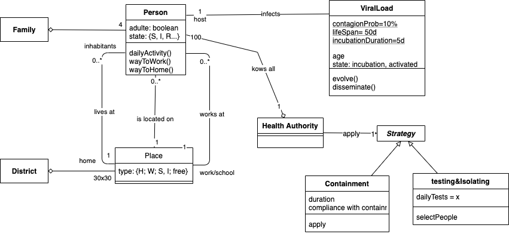

#   Cormas Covid 2020
 
The model description follows the ODD protocol for describing individual- and agent-based models (Grimm et al. 2006; 2010, 2020) and consists of seven elements. The first three elements provide an overview, the fourth element explains general concepts underlying the model’s design, and the remaining three elements provide details.
 
## Purpose
 *Methodology for preventing spread (decision support) or provide evidence on how the virus would spread (understanding) ?*
In the text : “Health authorities are requesting the scientific community working with agent-based simulation to provide insights about the relative efficiency of both strategies”
-> we will need indicators for comparing the efficiency of the strategies 
 
## Entities State variables and scales
The following class diagram presents the main types of entities and their state variables (attributes)

 
## Process overview and scheduling
 
<Which processes are represented in the model, in which order are they processed, and who is processing them (which kind of entity). 
 
## Design concepts
 
<Describe briefly how the following design concepts and elements are in taken account in your model; for simple models, often some design concepts are not used, for example “prediction”, so than leave those elements simply blank. See more detailed explanation of these elements in the appendix to this template.>
 
Emergence. –
Adaptation. –
Fitness. –
Prediction. –
Sensing. –
Interaction. –
Stochasticity. –
Collectives. –
Observation. –

## Initialization
*Q :  do we have patient 0? all person are potentially susceptible or there is someone already immune?*

 
## Input
 
<”Input” refers to environmental variables, that “drive” the dynamics of your model system (ecology: rainfall; econmics: work market price; physiology: pH of blood) and that are not produced (calculated) by the model itself, but imported from an external model or file. This does not include static landscape (GIS), but might include dynamic landscapes. In the course, you probably will have no Input.>
 
## Submodels
 
< Here you would, once your model and its analysis is finished, describe the submodels of your model, i.e. the procedures.>
 
<Process>. –  …
<Process>. –  …

# General guidelines for programming
 
-   First, write the “skeleton” of the model, i.e. globals, turtles-own, patches-own, setup and go procedures, and names (to something … end) of all procedures, but leaving the procedures empty.
-   Check for correct syntax regularly, as a beginner perhaps after each new line or block of lines that you entered.
-   First implement the setup procedure, and test it.
-   Then implement the most simple process, and use the most simple representation of this process, even you know that later on you would like to have a more sophisticated representation.
-   Before you proceed to implementing the next process/procedure, make sure you tested the first procedure thoroughly, which includes: visual debugging (check, visually, time step by time step, how the state of the turtles and patches change), use extreme parameter values, where you easily can predict the outcome of the model, for example if mortality is 1.0, all individuals should die…
-   Make sure including comments that explain the main parts of your model
-   Always: only include new elements (procedure or whatever), if you testet the current version thoroughly.
-   If you plan major changes, save the new version under a new file name. Then, if the new version ends up in a total mess, which often is the case, you can restart with the old version.

## Emergence
A certain system property or behaviour is emergent if it is not directly specified by individual traits. Which properties of the model system really do emerge from the interaction of the adaptive behaviour of the individuals, and which are merely imposed? For example, assuming a constant mortality rate means that mortality has been imposed, whereas if the sources of mortality are modelled mechanistically (e.g., including feeding, habitat choice, predation) then the mortality rate and population dynamics emerge from adaptive traits.
## Adaptation
Adaptation here refers to some kind of active choice by the individuals among alternative behaviours, with the decision depending on environmental or internal conditions. What adaptive traits do the model individuals have to improve their potential fitness, in response to changes in themselves or their environment?
## Fitness
In biology, fitness is the success of an individual in passing on its genes to succeeding generations; in an IBM, fitness is a consequence of behaviour. If the modelled agent is not biological, or if the modelled period is shorter than the life span of the organism, then fitness is replaced by a goal-function chosen by the modeller. Is fitness-seeking modelled explicitly (i.e. do individuals base their decision on explicit estimations of fitness) or is fitness-seeking more implicit, for example by implicitly assuming that certain decisions contribute to fitness? If fitness-seeking is modelled explicitly, how do individuals calculate fitness, i.e. what is their internal model of how expected fitness depends on which alternative behaviour is chosen? How is the individual’s current state considered in modelling fitness consequences of decisions? Does the individual’s internal fitness model change with life stage, season, or other conditions?
## Prediction
Prediction refers to the way an IBM represents how individuals foresee the future outcomes of their decisions. Tacit prediction includes simple, implicit assumptions about decision outcomes. Overt prediction explicitly forecasts the consequences of each alternative decision (Holland 1995). In estimating the fitness consequences of their decisions, how do individuals predict the future conditions (internal as well as environmental) they will experience? Do the individuals’ predictions make use of memory or learning or environmental cues?  If fitness-seeking is not modelled explicitly, what tacit (i.e., not explicitly stated and modelled) predictions are included in the IBM? What assumptions are implicitly embedded in the tacit predictions?
## Interaction
Interactions are mechanisms by which model individuals communicate with each other or otherwise affect each other. How do individuals interact? Do they interact directly, i.e., via preying upon one another, or indirectly, for example, through consumption of a shared resource? Are interactions local (in the neighbourhood of an individual) or global (with all individuals in the system)? How are interactions in the model related to real interaction mechanisms?
## Sensing
Sensing is the way an IBM represents how individuals obtain information about their (internal and external) environment and neighbouring individuals. What state variables are individuals assumed to “know”, or sense? Does the IBM represent the actual sensing or information gathering process? How accurate, or certain is the individual’s information?

## Stochasticity

Stochasticity in an IBM means that pseudo-random numbers are used to represent a process or trait. Is stochasticity used to simulate variability in input variables (see element ‚Input’ above)? What low-level processes are represented empirically as stochastic processes? What behavioural traits use stochastic processes to reproduce behaviour observed in real organisms? Is this approach clearly recognized and used as an empirical model?
Collectives
Collectives are aggregations of individuals, e.g. bird flocks and social groups, that have their own characteristics and behaviour. Collectives are an intermediate level of organization between individuals and populations. Are collectives represented in the IBM? Do collectives occur only as phenomena emerging from individual behaviour, or are individuals given traits that impose the formation of collectives? Are collectives represented as explicit entities with their own state variables and traits?

## Observation

Observation is the process of collecting data and information from an IBM; typical observations include graphical display of patterns over space and time and file output of summary statistics. What kinds of model results are observed to test the IBM and meet its objectives? From what perspectives are observations of results taken: omniscient, model individual, or virtual ecologist (a simulated ecologist, which is not omniscient but applies a certain protocol to collect data in the model system)?
 
 

